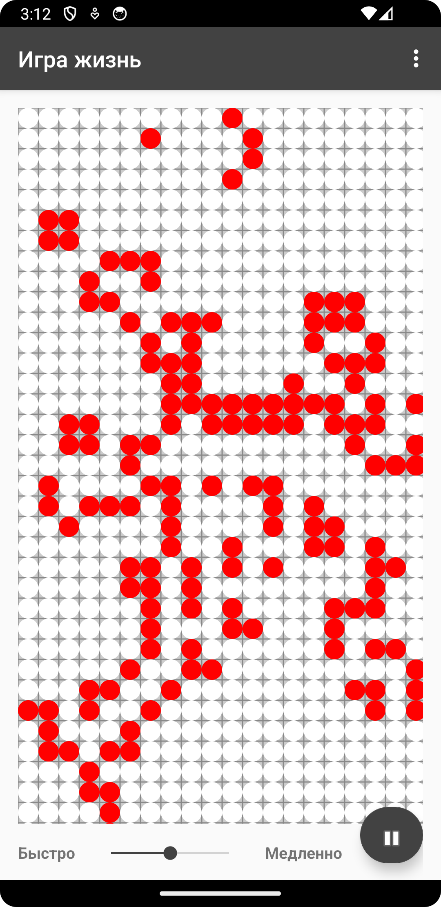
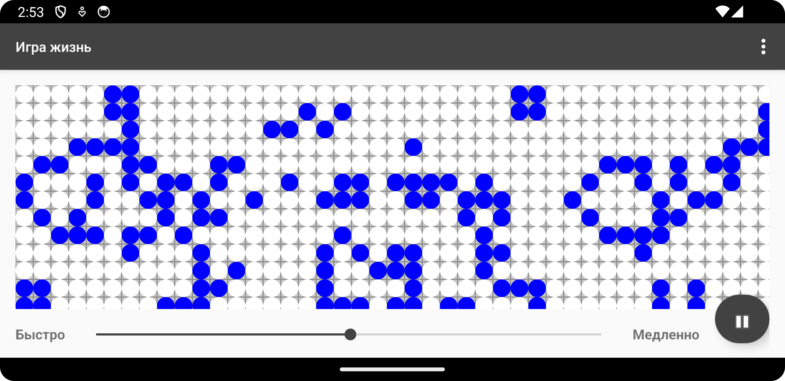
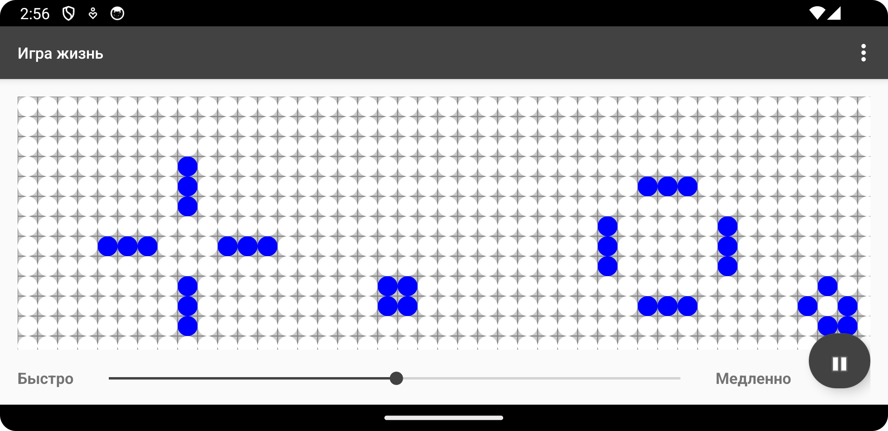
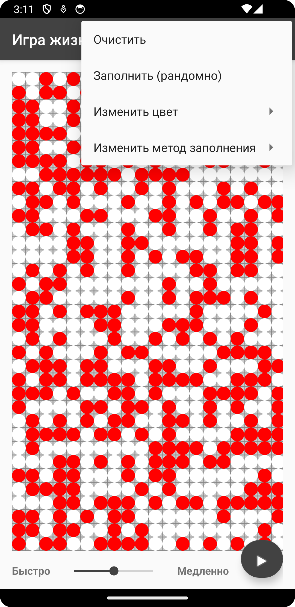

# Игра жизнь

Имплементация легендарной игры, с приятной графикой и простым интерфейсом.

## Об игре
[Игра «Жизнь» Википедия](https://ru.wikipedia.org/wiki/%D0%98%D0%B3%D1%80%D0%B0_%C2%AB%D0%96%D0%B8%D0%B7%D0%BD%D1%8C%C2%BB)

## APK файл
* <a href="app/apk/gameOfLife.apk">файл</a>

## Скриншоты

## О коде
1. <a href="app/src/main/java/com/example/androidgame/GameOfLifeView.java">GameOfLifeView</a>
* Использовался android.os.Handler, который отправляет runnable объекты в очередь объекта Looper. 
Через метод postDelayed объекта Handler и выполненно замедленние или ускоренние игры.
* Для рисования поля использовались объекты Canvas и Paint, переопределён метод onDraw для рисования поля
(удобен при вызове invalidate на view )
2. <a href="app/src/main/java/com/example/androidgame/Cell.java">Cell</a>
* Класс Cell представляющий точку на поле, с методами возраждения, смерти и обратное от состояния ячейки.
3. <a href="app/src/main/java/com/example/androidgame/World.java">World</a>
* Класс World инициализирует мир и выполняющий логику заполнения ячеек на новом поколении.
4. <a href="app/src/main/java/com/example/androidgame/MainActivity.java">MainActivity</a>
* MainActivity создаёт toolbar и отслеживает изменения на нём, при изменении меняется атрибут fps, который отвечает за количество кадров или скорость игры.
* Отслеживает изменения на кнопке старт/паузы, отслеживает изменения в Menu и выполняет соответсвующию логику.

